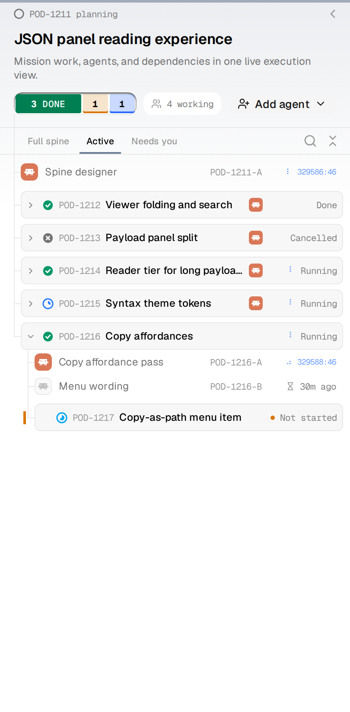
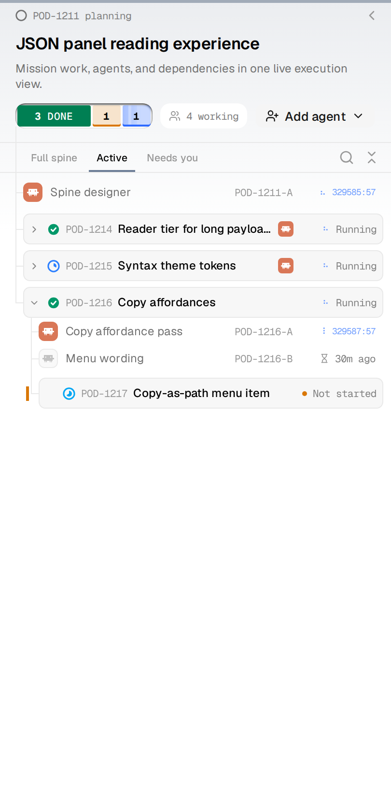
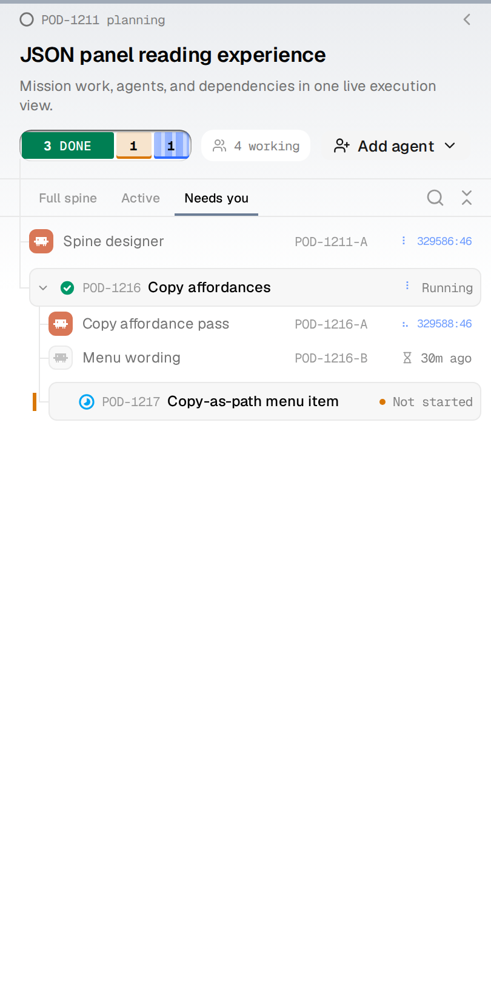
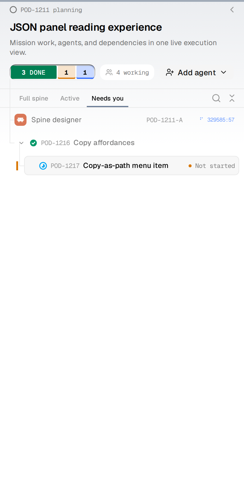

# Flight deck: what `Active` and `Needs you` actually hid

Two filters that looked broken in the field, for two different reasons. Both are
now fixed. Everything below is measured against the live database on this host
and rendered through the real `FlightDeck` in a browser (`harness/deck-entry.tsx`,
fixture `filters`).

## The one-line diagnosis

**`Active`** hid a finished task *unless it still had an agent on it* — where "on
it" meant only *not archived and not exited*. A **parked (hibernated) agent
satisfied that**, and parking is how an agent normally ends.

**`Needs you`** kept a match's ancestors on purpose, but a row carried no record
of *why* it was there. A done parent rendered exactly like the task that was
actually asking, and brought its whole crew of busy agents with it.

## How much it leaked

Measured over `~/.podium/podium.db`:

| | count |
|---|---|
| Closed tasks (done / cancelled / duplicate / superseded) | 62 |
| …that still carry an agent the old rule called "present" | **38 (61%)** |
| Agents sitting on finished work that still read as on the task | **38 of 47 (81%)** |
| Of those agents, how many were merely parked | 23 hibernated, 15 idle-but-live |

So on a mission of any size, `Active` was close to a copy of `Full spine`.

## Before / after — `Active`

The fixture is a mission with two finished tasks whose agents are parked
(POD-1212 done, POD-1213 cancelled), one finished task an agent is genuinely
mid-turn on (POD-1214), and live work.

Before — six rows, identical to `Full spine`. The cancelled task is right there:

After — the two parked-agent endings are gone. POD-1214 stays, because an agent
really is still working on it:

## Before / after — `Needs you`

One task is in review (POD-1217). Its parent (POD-1216) is done and carries two
agents.

Before — the done parent is a full strip saying "Running", with both of its
agents hanging off it. Three of the four rows are not asking for anything:

After — the tree still draws down to the match, but the parent is scaffolding:
no fill, no state word, no agents. One strip, and it is the one that wants a
decision:

## The rules now

**`Active`** — a closed task stays visible only while an agent on it is genuinely
working (`motionPhase === 'working'`, the same verdict the green dot and the
braille spinner read). A hibernated session is demoted to `ready` upstream, so a
parked agent can never qualify. The escape hatch survives for the case it was
built for: an agent really can still be running on a task somebody already
closed, and hiding that would lose it.

Cancelled, duplicate and superseded ride the same rule with no second code path,
because `issueClosed` already treats every ending alike.

**`Needs you`** — rows now carry `matched`. A row that matched itself renders as
a strip and lists the agents that are actually asking. A row kept only as the
*path* to a match renders as scaffolding and lists none. The mission header is
explicitly exempt: it is the column's statement of which mission is on screen,
not one of the rows a view filters.

## Still open, not fixed here

A task sitting in `review` counts as "needs you" even with no agent, no question
and no offer. That is a product decision rather than a bug, and if `review` is
used as a parking lane it will keep the list busier than these fixes alone can.

## Tests

`mission.test.ts` covers the filter rules; `FlightDeck.test.tsx` covers the
scaffolding treatment. Every new test was checked against the pre-fix code and
fails there — 8 in the viewmodel, 1 in the deck.
