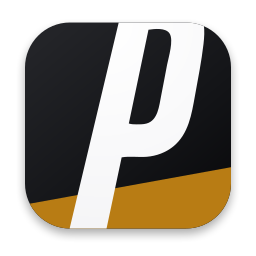
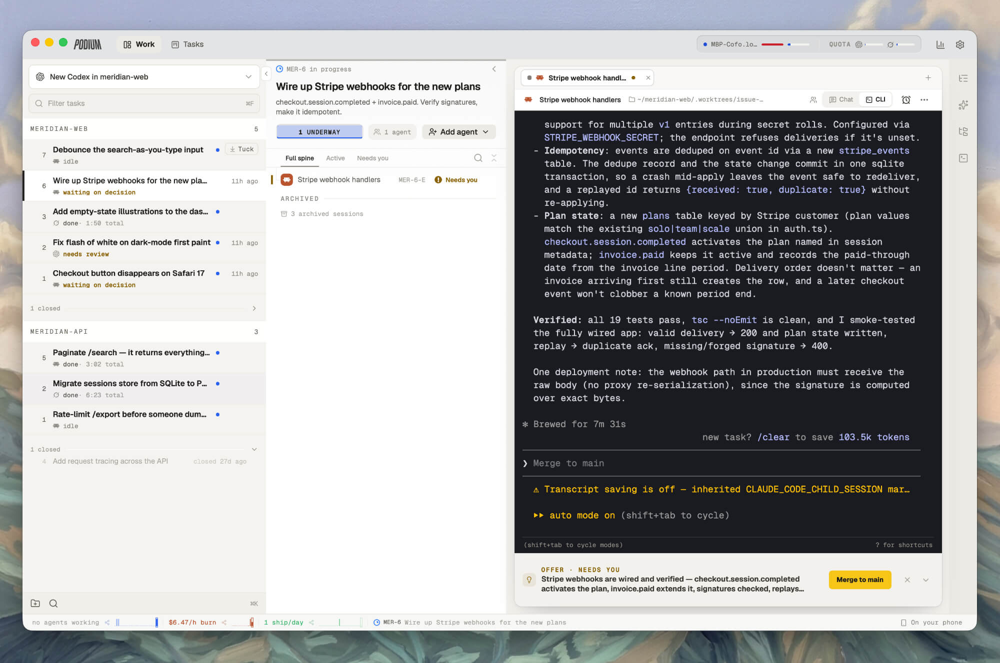

<h1 align="center" style="text-align:center">
  &nbsp;Podium ADE
</h1>

<p align="center" style="text-align:center"><strong>Ship more, better.</strong></p>

<p align="center" style="text-align:center">Podium ADE is a multi-agent orchestrator running on your Mac, on your VPS and on your phone. It comes out of the box with cross-harness subagents and agent communication.</p>

<p align="center" style="text-align:center"><a href="https://github.com/madeinorbit/podium/releases/latest"></a> <a href="./LICENSE"></a> <a href="https://discord.gg/VaWtxQxSRU"></a></p>

<p align="center">
  
</p>

## Download

**Desktop app**

[](https://github.com/madeinorbit/podium/releases/download/v0.1.0/Podium_0.1.0_aarch64.dmg)

Intel Mac builds are also supported. Windows and Linux builds are previews until their packaged acceptance checks pass. Download them from the [releases page](https://github.com/madeinorbit/podium/releases/latest).

**Headless server**

```bash
curl -fsSL https://github.com/madeinorbit/podium/releases/latest/download/install.sh | sh
```

Then run `podium` and finish setup in the browser at the printed URL.

<!-- TODO(launch): product screenshot goes here, then delete this comment.
<p align="center">
  
</p>
-->

## Features

- **Cross-harness subagents.** Any session can spawn a delegate on a *different* CLI with
  `podium agent spawn --harness codex`. Claude Code, Codex, Grok, opencode and Cursor work the
  same issue side by side, each on the model you pick.
- **Agents that talk to each other.** A real mailbox between sessions and issues: agents hand
  off work, ask each other questions, and interrupt each other, and you read the whole thread.
- **Real terminals, remotely.** Every agent runs in a persistent PTY on your machine, tmux-style,
  with no `-p` flag abstractions. Attach from any browser; nothing dies when you close the tab.
- **Mobile control.** The phone web app lets you check on a long task, answer an agent's
  question, and kick off the next one. The planned first native release is iPhone-only.
- **Agents that track their own work.** A built-in issue tracker with a CLI and MCP surface the
  agents drive themselves. They claim issues, file discovered work, and report progress while
  you watch the board.
- **Worktree-native and multi-machine.** Sessions group by git worktree, so parallel feature work
  is the default rather than a hack, across as many paired machines as you connect.

## Get started

Podium gives you access to your agents no matter where you want to run them, whether that's on
your laptop, desktop or on a VPS you own.

### All-in-one desktop app

If you'd like to start simple, just download the desktop app and everything will work out of the
box, with your agents running locally.

### Always-on VPS (recommended setup)

To get more out of your agents, they should keep running when your laptop is off. Just install
Podium on your VPS and access it through the web client, desktop app or mobile app. Besides the
VPS, you can connect as many other machines to run agents on as you want. While your laptop is
on, you can run agents on there through Podium as well.

Each extra machine joins with the token the server shows you in the UI:

```bash
curl -fsSL https://github.com/madeinorbit/podium/releases/latest/download/install.sh | sh -s -- --join <TOKEN>
```

The server needs to be reachable over the network from each client and each machine running
agents. We recommend using Tailscale to connect your machines, but Podium can be protected by a
password and be exposed to the open internet. See
[docs/adding-a-machine.md](docs/adding-a-machine.md) for the details.

## Security

We take security seriously and continuously run audits on Podium.

You can expose Podium to the open internet and protect it with a password. We do recommend
connecting to it over a tunnel like Tailscale though.

If you find a vulnerability, please report it privately. See [SECURITY.md](./SECURITY.md).

## Contributing

We'd love your help. Bug reports, ideas and pull requests are all welcome, and you don't need to
ask permission to open one. [CONTRIBUTING.md](./CONTRIBUTING.md) has everything you need to get
the project running locally, and [ARCHITECTURE.md](./ARCHITECTURE.md) explains what goes where.

## License

[Apache License 2.0](./LICENSE). © 2026 Michael Wirth, Till Felippi and the Podium contributors.
Third-party licenses are listed in [THIRD-PARTY-NOTICES.md](./THIRD-PARTY-NOTICES.md).
