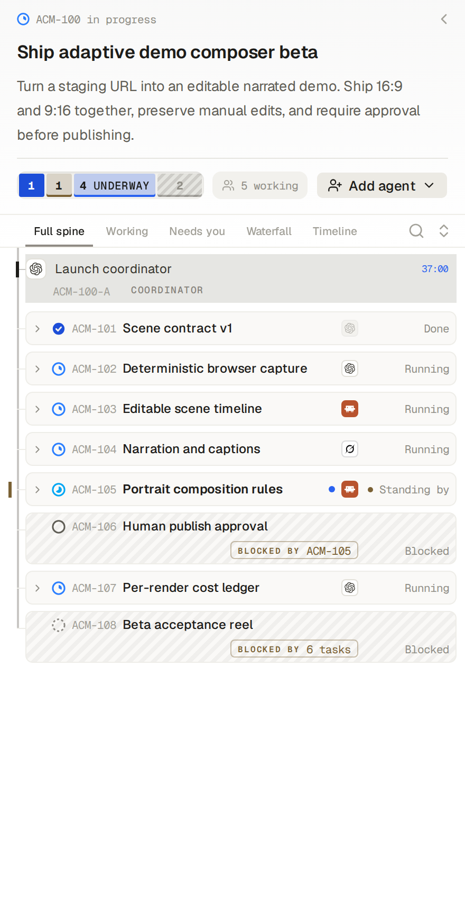
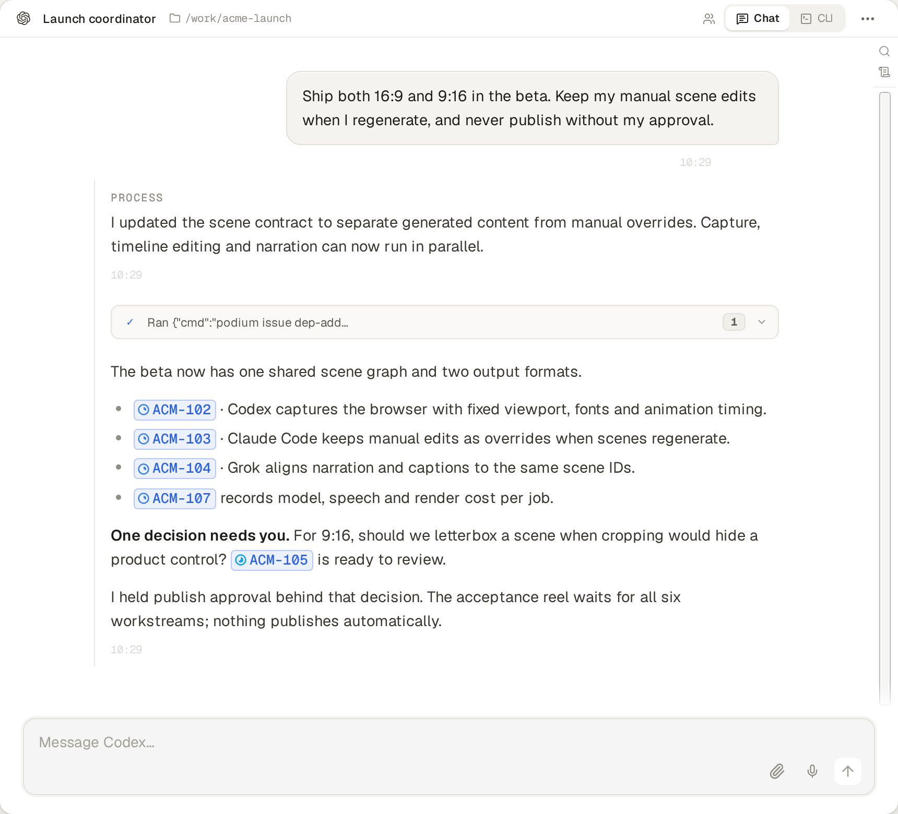
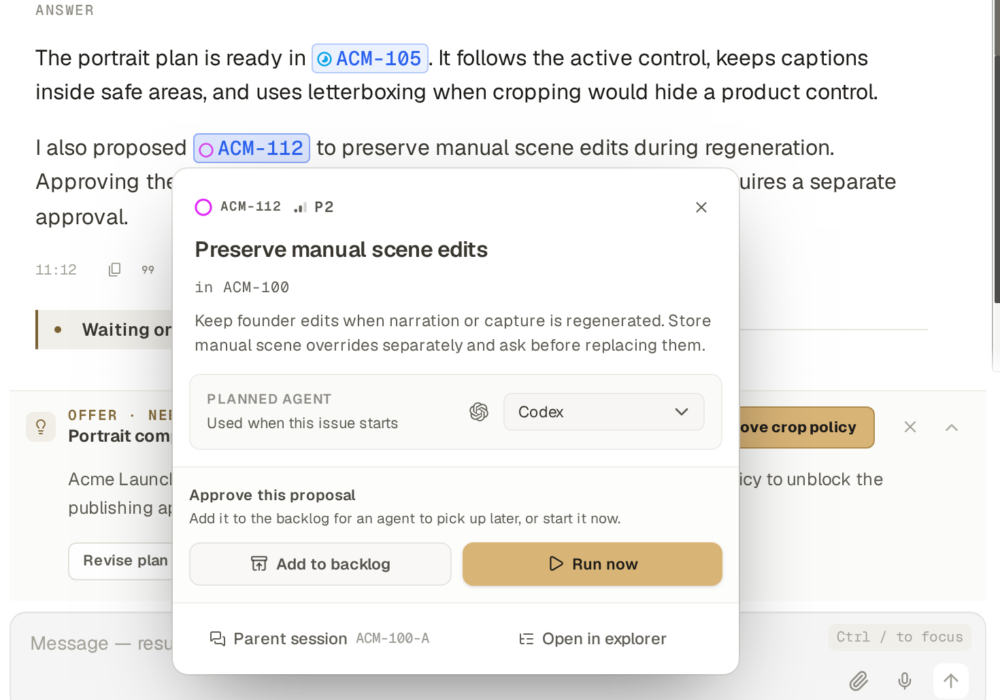
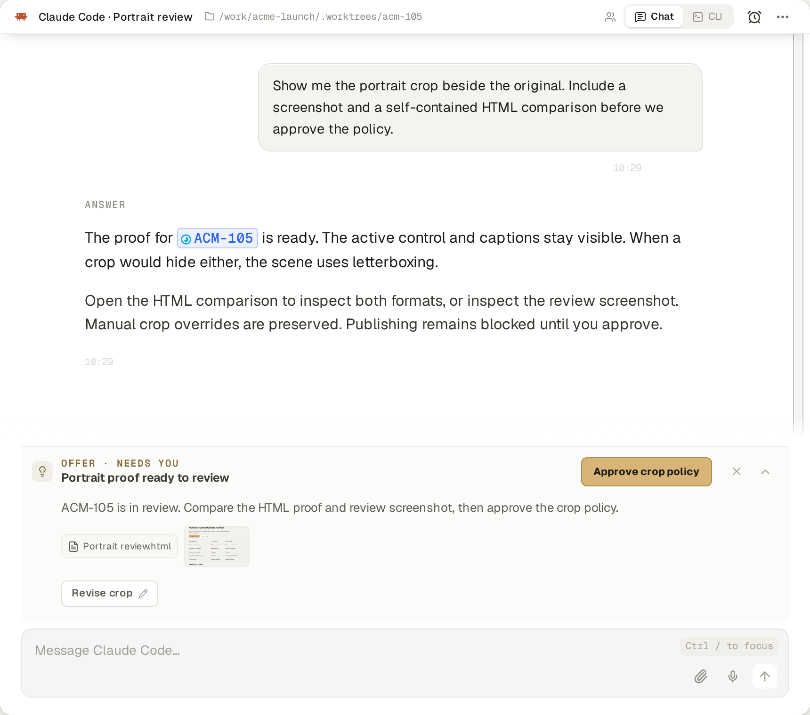
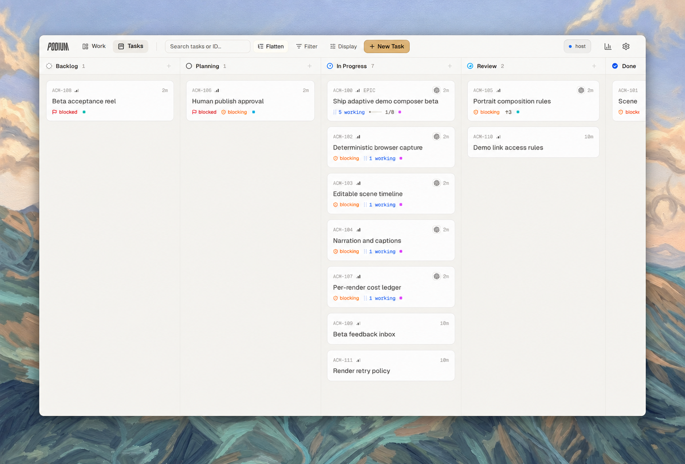

<h1 align="center">
  &nbsp;Podium
</h1>

<p align="center"><strong>Think bigger. Your agents will keep track.</strong></p>

<p align="center">An open-source agent development environment. Work through an idea with your coding agent, then ask it to organize the tasks and coordinate the team. Keep the whole effort visible and under your direction.</p>

<p align="center">
  <a href="https://podium.do/">Website</a> ·
  <a href="#get-started">Get started</a> ·
  <a href="https://podium.do/docs">Docs</a> ·
  <a href="https://github.com/madeinorbit/podium/releases">Releases</a> ·
  <a href="https://discord.gg/VaWtxQxSRU">Discord</a>
</p>

<p align="center">
  <a href="https://github.com/madeinorbit/podium/releases/latest"></a>
  <a href="LICENSE"></a>
</p>

<p align="center">
  
</p>
<p align="center"><sub>Your projects, their tasks, and the agents doing the work, all in one place.</sub></p>

## More agents shouldn't mean more project management

You have agents that can write code, investigate a problem, review an approach, and test the result. But someone still has to split up the job, pass along findings, explain dependencies, and remember what hasn't finished. Usually, that's you.

Podium gives your agents a shared task system they can operate themselves. The agent you're talking to can become the coordinator: create subtasks, bring in other agents, link dependencies, and track their results. You see the same work in the board and team views, and can join any conversation along the way.

Start with a rough idea. Work out the approach together. Then give your agent a bigger job.

## One conversation. The right agents for the job.

For a feature you've already discussed, try a prompt like this:

> Act as the coordinator. Break this into phases and subtasks, and link their dependencies. Ask Claude Code to propose the architecture and Codex to review it. After we've agreed on the approach, delegate implementation into separate tasks that can run in parallel. Have Grok test the result against our original plan. Keep the tasks updated and bring decisions back to me.

Pick the agents and models you want for each part. Podium supports cross-agent delegation and communication across Claude Code, Codex, Grok, OpenCode, and Cursor. Use the agents you've set up on your machines; their accounts and usage limits still apply.

**Be explicit about coordination.** Ask for phases, subtasks, dependencies, and reviewers. Those instructions shape how the agent uses Podium's tools. You can change the plan in conversation as you learn more.

## A closer look

<table>
  <tr>
    <td width="50%" valign="top">
      <h3>See the whole team</h3>
      <p>Follow the coordinator, parallel agents, and dependent tasks in one view. Open any conversation to join the work.</p>
      <p align="center"><a href="docs/assets/readme/team-view.png"></a></p>
    </td>
    <td width="50%" valign="top">
      <h3>Shape the workflow as you talk</h3>
      <p>Discuss the approach, choose agents for different jobs, and change the plan. Your coordinator keeps the tasks connected.</p>
      <a href="docs/assets/readme/coordinator-chat.png"></a>
    </td>
  </tr>
  <tr>
    <td width="50%" valign="top">
      <h3>Give new ideas somewhere to go</h3>
      <p>Capture your ideas in tasks. Agents also create proposals for improvements they discover while working. Review them, add them to the backlog, or start when you're ready.</p>
      <a href="docs/assets/readme/proposed-task.png"></a>
    </td>
    <td width="50%" valign="top">
      <h3>Stay involved in the decisions</h3>
      <p>Ask for a comparison, inspect the evidence, and discuss the result. Agent offers keep the decision beside the work.</p>
      <a href="docs/assets/readme/agent-offer.png"></a>
    </td>
  </tr>
</table>

## The task system is what makes the team work

An issue in Podium holds the goal, the breakdown, dependencies, and progress. Agents create and update that structure directly through Podium's CLI and MCP tools. The same issues are what you use to understand and steer the work.

That gives coordination somewhere to live beyond a single conversation. A session can end while the task, its brief, and its recorded progress remain available to the next agent. A follow-up can wait on a prerequisite without you keeping it in your head.

Work is organized around tasks. Each issue can own its branch and workspace, with several agents contributing to it. Separate implementation tasks can have separate workspaces; agents sharing one workspace still need clear ownership of their changes.

<p align="center">
  
</p>
<p align="center"><sub>The same project, seen across tasks. Agents' work and dependencies stay visible as the effort grows.</sub></p>

## A project that made it click for us

We used Podium to build a competitor research and comparison system. We asked the initial chat agent to coordinate the effort, establish a research contract, and organize the phases. More than 50 research agents investigated competitors in parallel. Prototype and production tasks for hundreds of comparison pages were already in the task system, waiting on the research they needed.

We could discuss the approach and follow the work without manually handing every result to the next agent. That's the experience we're building Podium around: taking on work that would otherwise be too much coordination to enjoy.

## Give your agents a machine of their own

Run locally or install Podium on your own VPS. Agents on that server can keep working when your laptop is off. Reconnect from your desktop, browser, or phone.

[Set up your own server →](#run-on-your-own-vps)

## Get started

Podium is pre-1.0 and moving quickly. This README describes current development; check the [release notes](https://github.com/madeinorbit/podium/releases) for what's in a packaged build.

See the [update guide](https://podium.do/docs/guides/update-backup) for stable and edge channels.

### Start on your desktop

**[Download Podium →](https://github.com/madeinorbit/podium/releases/latest)**

Choose the package for your machine from the release assets. macOS is supported; Windows and Linux desktop packages are previews. Available architectures depend on the release. See the [installation guide](https://podium.do/docs/getting-started/install) for details.

Open Podium, set up the coding agents you want to use, and start with a repository and a task. You can begin with one agent, then ask it to coordinate a larger effort when you're ready.

### Run on your own VPS

Install the headless server on Linux x86_64 or ARM64:

```bash
curl -fsSL https://github.com/madeinorbit/podium/releases/latest/download/install.sh | sh
```

Follow the setup prompts. If setup didn't run during installation, run `podium setup`. Run `podium` to start the instance; it prints the browser URL. If your shell doesn't yet find the command, open a new login shell so the installer's PATH change takes effect.

The [installation and networking guide](https://podium.do/docs/getting-started/install) covers remote access through Tailscale, Cloudflare, or your own reverse proxy. Connect from the desktop app or a browser, including your phone's browser.

To add another machine, copy the pairing command from **Settings → Machines → Add machine** and run it there. Choose where your agents work while keeping the task system in one place.

### Build from source

Follow [CONTRIBUTING.md](CONTRIBUTING.md) for prerequisites and setup, and [ARCHITECTURE.md](ARCHITECTURE.md) for the system design.

## Build it with us

Tell us about the job you tried to hand to your agents and where you still had to do the coordination yourself. Those are the problems we want to hear about.

- [Join the conversation on Discord](https://discord.gg/VaWtxQxSRU).
- [Report a bug or suggest an improvement](https://github.com/madeinorbit/podium/issues).
- [Contribute a change](CONTRIBUTING.md). Bug fixes, documentation, and ideas are welcome.
- Report vulnerabilities privately using [SECURITY.md](SECURITY.md).

[Apache License 2.0](LICENSE). © 2026 Michael Wirth, Till Felippi and the Podium contributors. See [third-party notices](THIRD-PARTY-NOTICES.md).
