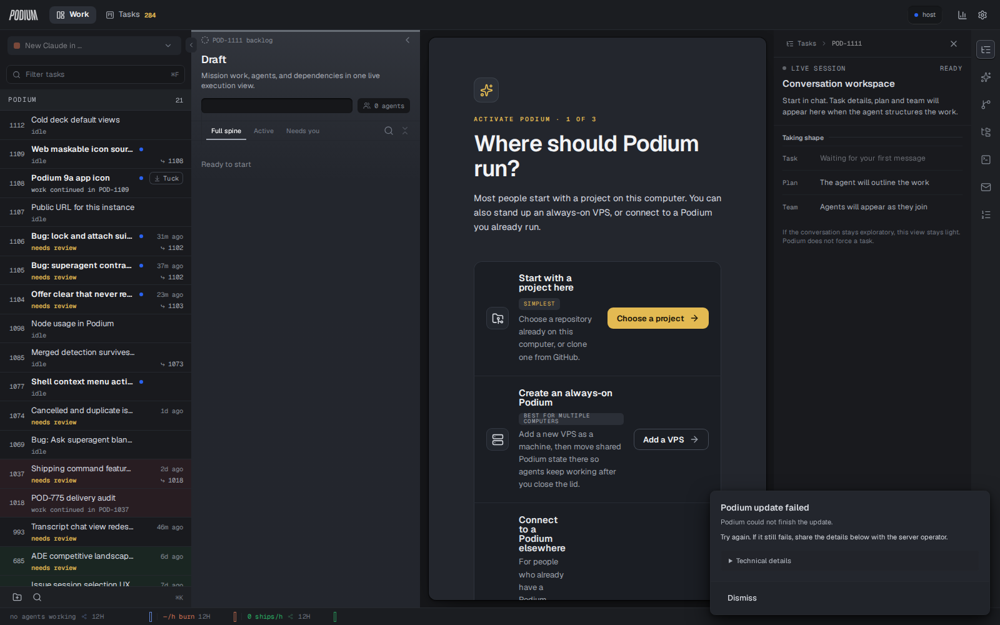
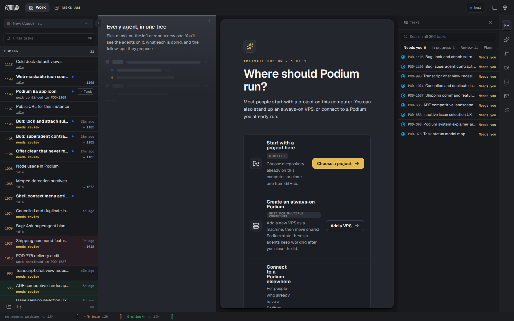

# The cold deck — before and after

What the shell shows after a reload when nothing is open. Captured from a
from-source instance on a snapshot of the live task database, with the persisted
selection left where a reload actually leaves it: on `POD-1111`, the composer's
**draft vessel** — a placeholder issue minted so a session has somewhere to live,
whose session never started.

## Before



- **Flight Deck** builds full mission chrome over the vessel: `POD-1111 backlog`,
  the title *Draft*, the generic blurb, a `0 agents` gauge, the view bar, and an
  empty spine reading *Ready to start*.
- **Issue explorer** opens on that vessel — trail `Tasks › POD-1111`, detail
  panel *Waiting for your first message* — rather than on the task list.

Recorded deck text:

```
POD-1111 backlog Draft Mission work, agents, and dependencies in one live
execution view. 0 agents Full spine Active Needs you Ready to start
```

## After



- **Flight Deck** falls through to the empty state it already had: *Every agent,
  in one tree*, with the ghost tree under it.
- **Issue explorer** opens at level 0 — trail `Tasks`, the full task list with
  its buckets (Needs you 9, In progress 3, Review 11, …).

## Why

`missionRootFor` answers a structural question — every task has a root — and the
shell's columns were using it to answer a different one: *is there a mission on
screen at all?* `selectedMissionRoot` answers that one, and a draft vessel nobody
filled resolves to nothing. A draft that IS filling (the live composer, session
attached) still resolves, so composing is unchanged.

The explorer additionally stopped falling back to the raw `selectedIssueId` when
no mission resolves: that fallback could only ever open the panel on a task the
operator did not choose.

The centre pane in both shots shows the activation wizard because the test
instance has no repos configured; it is not part of this change.
