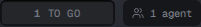
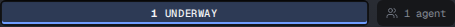
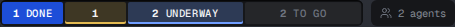
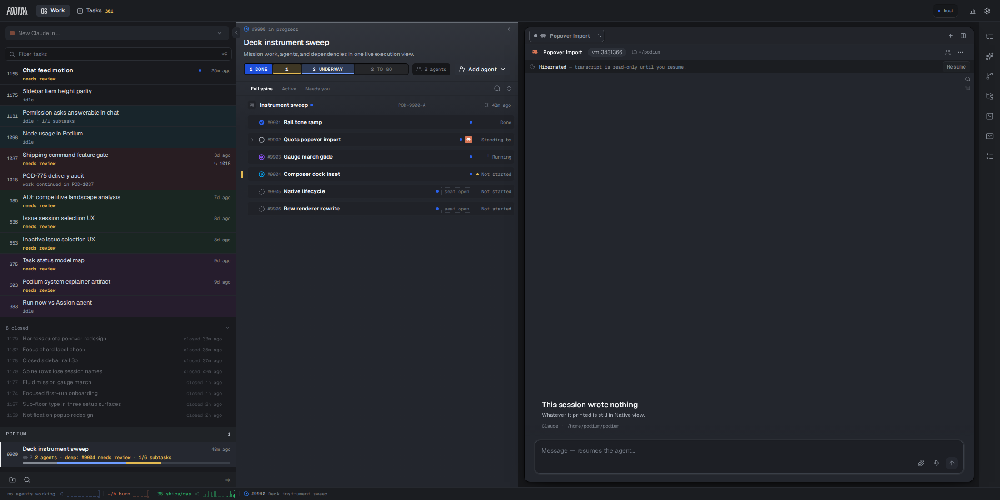

# The gauge's `to go` band was swallowing two stages

## What was reported

POD-1179, a task in `planning` with an agent working in it, showed **`1 TO GO`** in the
mission gauge.



## Why

`missionProgress` (`packages/client-core/src/viewmodels/mission.ts`) classifies each unit
exclusively, `done → block → review → run → wait`, and `wait` is the **remainder**:

```ts
if (issueClosed(issue)) done += 1
else if (issue.blocked) block += 1
else if (issue.stage === 'review') review += 1
else if (issue.stage === 'in_progress') run += 1   // ← only one stage
// wait = total - done - run - review - block
```

`run` matched `in_progress` alone, so **`planning` and `shipping` fell through into the
remainder** — the band whose word is `TO GO`, i.e. "nobody has picked this up". That is
false of a task an agent is designing in, and false of a task already in Shipping's
custody. The band is stage-keyed by design (motion, not the word, carries "an agent is
computing right now"), so the stage falling in the wrong bucket is the whole bug.

## The fix

`run` is now every stage whose own name says the work has begun:

```ts
const UNDERWAY = new Set(['planning', 'in_progress', 'shipping'])
```

`shipping` there also settles a disagreement that predates this: `deckIssueState` and
`operationalState` already read a shipping task as working — the meter was the only
surface that did not.

**The band is renamed `UNDERWAY`.** It wore `IN PROGRESS` while its bucket was one stage;
a band covering three cannot wear one stage's label, so it takes the word all three share
and none of them owns. Its container-query rung moves 86px → 70px with the shorter word,
so the word now survives on a band **16px narrower** than before (measured against the
built stylesheet: the word paints from a 76px band, where it used to need 92px).

## After

A lone root in `planning` with an agent on it — POD-1179's exact shape:



One mission holding `done` / `review` / `planning` / `shipping` / `backlog`:

| | reading |
|---|---|
| before | `1 of 6 tasks done, 1 in review, 4 to go` |
| after | `1 of 6 tasks done, 2 underway, 1 in review, 2 to go` |



The `in review` band sheds its word here because its share of the track is under its own
rung — the ladder working, not a clip. The full deck:



## Two sibling inconsistencies fixed on the way

- The folded rail's `reading()` said **`running`** where the open gauge said
  **`in progress`** for the same bucket, under a comment claiming both speak "the same
  sentence, so folding cannot change what the mission is said to have done". Both say
  `underway` now.
- The fold's own two-colour meter (`collapsedSummary.run`) counted `in_progress || review`
  as started, so a folded branch hiding a `planning` or `shipping` child counted it in
  `tasks` and in neither tier — painting picked-up work into the trough. It reads
  `UNDERWAY` too.

## Verified

Against an isolated from-source instance (not the live service), driving the real deck:
both readings above are live captures. Plus 3 new viewmodel tests (207 pass in
`mission.test.ts`), the 5 web gauge/meter/deck suites, and `tsc` clean for
`@podium/client-core` and `@podium/web`.
