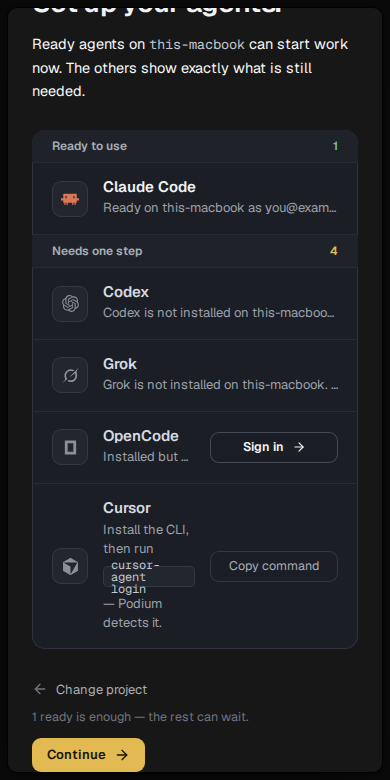
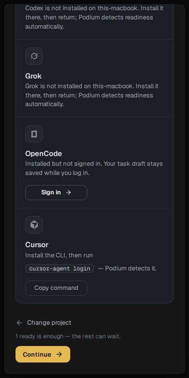

# POD-1200 — setup no longer hands over a half-configured Podium

Four changes, all inside first-run setup.

## 1. Closing the project picker no longer ends setup

Reported path: **Work locally → pick a project → back → close the picker** landed in a
half-ready Podium.

Two things had to be true for that:

- The picker's close (X / Esc / click-outside) routes back to `welcome`.
- `welcome` was the *default* route, so it was the one step that wrote **no**
  `?activation=` param — and setup stayed on screen only while "no repos and no
  sessions" held, **or** that param was present. Picking a project had already
  added a repo, so both halves went false at once and the shell appeared.

Fixed on both sides:

- `activationUrl` now writes **every** route, `welcome` included. The param is
  removed in exactly one place: when setup is over.
- Setup being *underway* is now durable state (`podium.onboarding.active`,
  device-local) rather than something inferred from an empty install.
  Entering any step sets it; only finishing clears it. So setup ends by being
  finished — never because its own first step created a repo.

## 2. The bottom of every setup step was unreachable

This turned out to be worse than a missing margin. The step frame is a flex item
of the sheet above it, so as soon as a step was taller than the window it was
**shrunk to the window height** and its children spilled past its padding box:
the last control ended up flush against the bottom edge with the step's whole
`pb-*` stranded above it, out of the flow.

Measured on the agents step, scrolled to the end — gap between the *Continue*
button and the bottom of the scrolled content:

| viewport | before | after |
| --- | --- | --- |
| 390 × 780 (phone) | **0 px** | 24 px (32 px to the window edge) |
| 1280 × 720 (small laptop) | **0 px** | 56 px (68 px to the window edge) |

`shrink-0` on the frame is the fix. It applies to every setup step, not just this
one — the agents step is simply the one whose last element is a button.

## 3. Agent rows on a phone

Falling out of the same screenshots: at 390 px the text column was squeezed to
~150 px, so the `cursor-agent login` pill wrapped onto three lines *inside* a
21 px box and then collided with the Copy command button. The action button now
drops to its own line below `sm`, the pill never breaks, and the hint wraps
instead of being ellipsised in a column that has room for it.

## 4. The VPS promise is now true

"If you move to a VPS later, your tasks come along" was not true. It now says
moving means starting fresh there, that projects, tasks and history cannot move
across yet, and that carrying them over is coming.

## Verification

- `apps/web` setup + app shell suites: 64 files, 522 tests, green. Repo typecheck green.
- New: `use-activation-route.test.tsx` (flag set on entry, cleared only by
  finishing, welcome written to the URL, stable `navigate` identity) and two
  cases in `activation-route.test.ts`.
- Screens measured in a throwaway vite harness rendering the real
  `FirstTaskActivation` against the real stylesheet. The 0 px reading is the
  positive control: it moved to 24/56 px with the fix and back to 0 px with the
  fix removed.
- Two limits of that harness, neither of which the finding rests on: it did not
  render the top bar setup keeps, so a real window has ~48 px less height (more
  overflow, not less), and it did not prove Geist itself loaded rather than a
  fallback. Both change how tall the content is; the gap being measured is the
  frame's own bottom padding, which was stranded outside the flow at any height.
