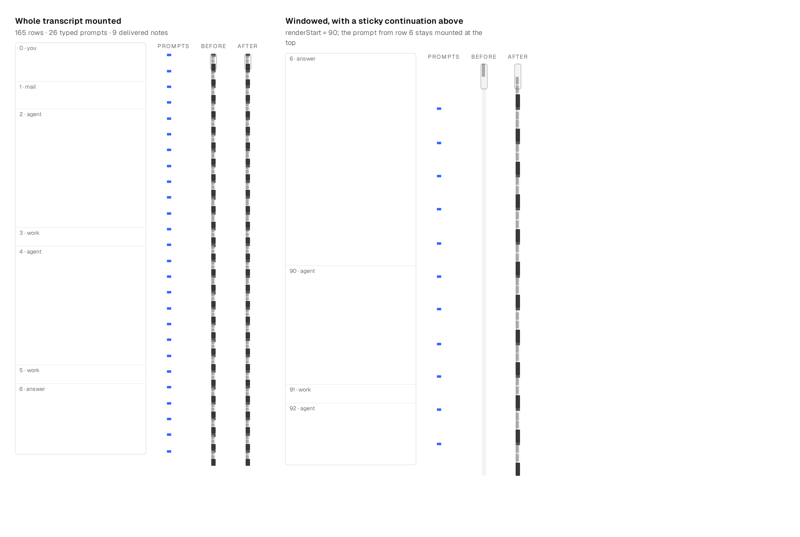
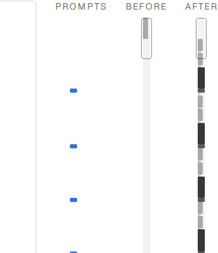
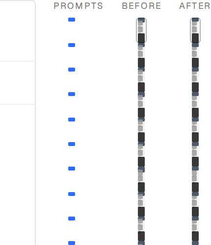

# The transcript map stopped showing your messages

Reported as "the mini map does not show user messages anymore — or not reliably, or
maybe not clear enough". All three readings were right; they are three separate
defects, and they compound.

## 1. Past 300 rows the map went nearly blank

`RENDER_WINDOW` is 300 rows. Past that the feed mounts the window **plus** the
nearest operator prompt from above it, as a one-row sticky continuation carrying
its own absolute `[data-block]` index. The map inferred its window base from the
**smallest** measured index — which is that continuation's, not `renderStart`.

- Sticky prompt just above the window → every band shifted one row, so a prompt
  band was painted where the work after it actually sits.
- Sticky prompt far above → the rebased indices landed past the end of the
  windowed row list, matched nothing, and the map drew **one tick for the whole
  transcript**.

The base is now passed in from the feed (`baseIndex = renderStart`) instead of
guessed, and blocks below it are dropped rather than rebased — the continuation is
a repeat of a row the map already covers further down.

## 2. A prompt band was painted over by the work under it

Ticks are absolutely positioned siblings with no `z-index`, so the later one wins
wherever two overlap — and they do overlap, because a band shorter than the floor
is drawn at the floor. A typed line is the shortest row in a long transcript and
the run of work under it is the longest, so drawing in row order let that work
repaint all but a sliver of the band the reader was scrubbing for.

The field (`agent`, `work`) now paints first and the landmarks (`you`, `answer`)
paint over it, and the landmarks get a 4px floor instead of the shared 2px — a
legible dash on a 7px track rather than a hairline.

## 3. Delivered mail looked exactly like something you typed

Every delivered message reaches the harness as a `role: 'user'` turn — agent mail,
superagent traffic, a headless thread's machine-context seed, an interrupt. Testing
the role alone spent the map's one hue, its widest band and its highest rung on all
of it. The map now takes the feed's own "the human typed this" predicate
(`isOperatorPromptRow`); machine traffic reads as Work.

## Measured, in a browser, against the same rows and the same geometry

165-row transcript, 26 typed prompts, 9 delivered notes. "Prompts" is ground truth
read from the DOM, not from either map.

| | ticks | You bands | prompts located | thinnest You band |
|---|---|---|---|---|
| before, whole transcript mounted | 165 | 35 | 26/26 | 1.8px |
| after, whole transcript mounted | 165 | **26** | 26/26 | **4px** |
| before, windowed (`renderStart` 90) | **1** | **0** | **0/11** | — |
| after, windowed (`renderStart` 90) | 75 | **11** | **11/11** | **4px** |

