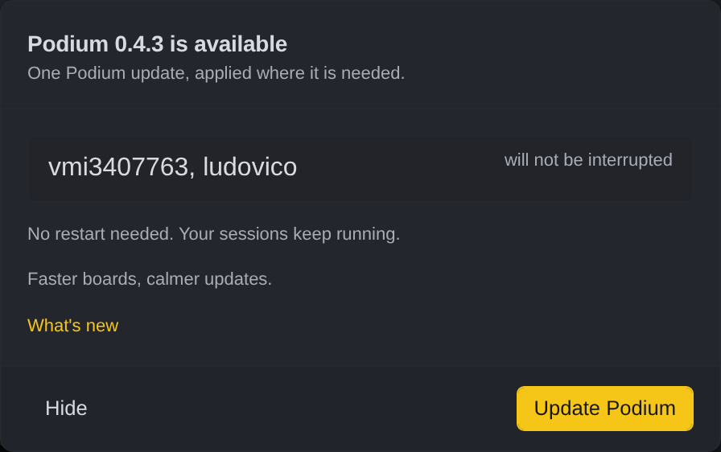
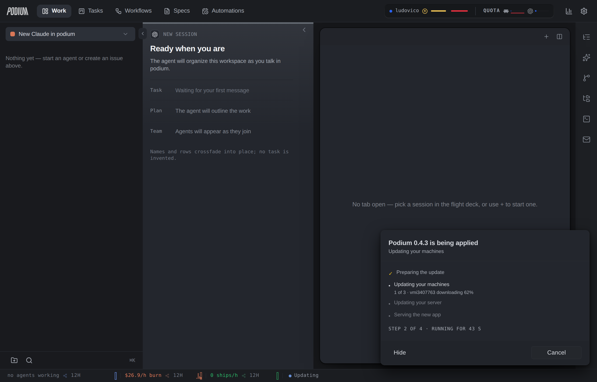
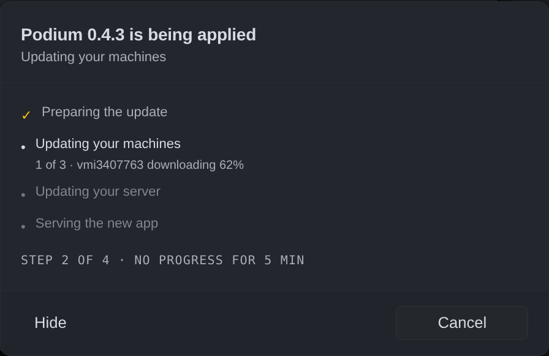
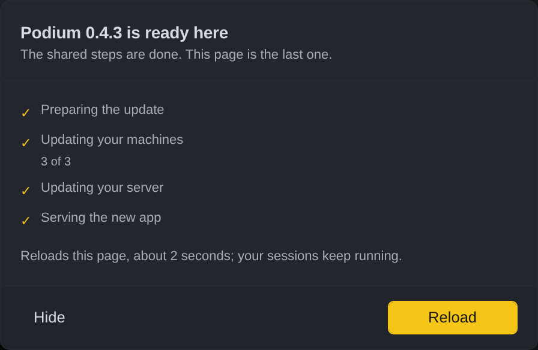
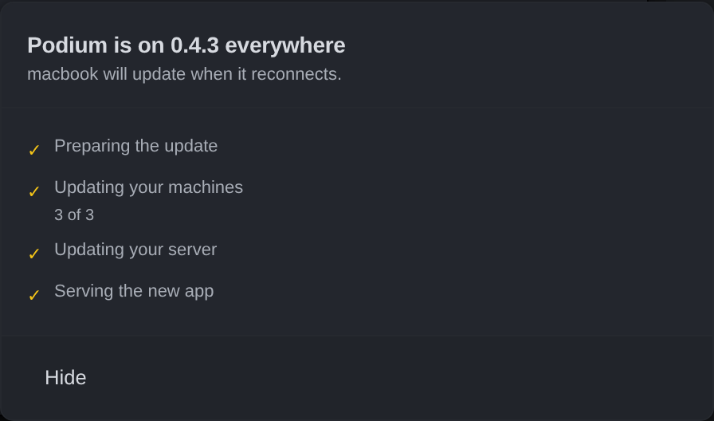
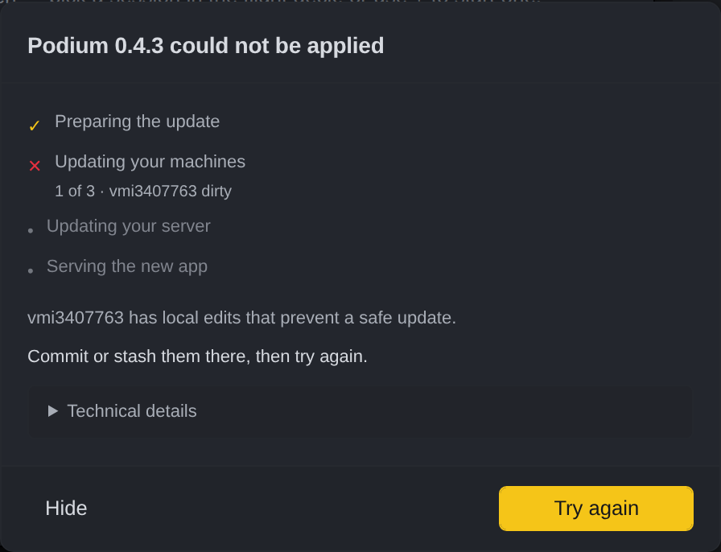
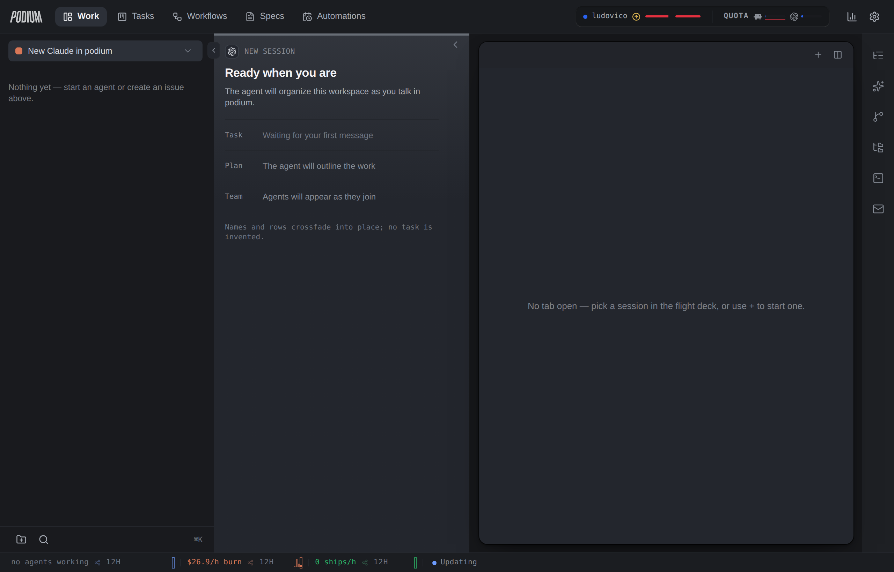

# Update operation panel — the states, from the running app

**Issue:** POD-2102 · **Spec:** `2026-08-14-update-operations-design.md` §6, §7
**Captured:** 2026-08-16, branch `issue/2102-update-operation-panel`, dark theme, 1280×820.

These replace the old dialog shots in this folder (`available-*.png`, `in-progress.png`,
`failed*.png`, `required.png`, `no-restart-needed.png`), which document a UI that no longer
exists: three progress models, four dismiss labels, up to three co-equal primary buttons.

**How they were taken, exactly.** The branch app, served by vite from source, against the
e2e harness relay — the real component tree, the real CSS, the real status strip. The
operation payloads were supplied at the tRPC boundary (`operations.active` /
`operations.history`) rather than by the engine, because the server-side `update` KIND is
POD-2098's deliverable and lands in parallel. That substitution is exactly the seam the
design puts there: the panel is a pure function of the operation payload
(`operation-view.ts`), and the payloads used here are the §3.1 shape verbatim. What is NOT
demonstrated by these shots is the server producing those payloads.

---

## Offer — before anything starts

An offer is not an operation (§3.2): nothing exists on the server yet, so this is still the
place-language copy the old dialog got right, kept whole. One primary — **Update Podium** —
and one dismiss verb.

## Running — the checklist, live

The plan's own named steps, in order: done ones checked, the current one carrying its
substatus straight from `steps[].places` ("1 of 3 · vmi3407763 downloading 62%"), pending
ones dimmed. The counter is honest because the steps are the plan, not a synthesized count.
The line under it says **Step 2 of 4 · Running for 46 s** — the liveness half of P4.

Cancel sits as a secondary. It is always offered while an operation runs: reversibility is a
property of the kind's step runners and does not ride the wire, and the engine already
answers a refusal as a returned value, which the panel renders as a sentence.

In context: non-modal, bottom-right, above the status strip — which now carries the update
indicator (bottom right, "• Updating").

## Stalled — visibly stuck, not ambiguously slow

Same panel, heartbeat gone quiet: **NO PROGRESS FOR 5 MIN**, and the toolbar indicator turns
from animating to attention. "Working" and "stuck" are never the same picture (§6.3).

## Your turn — the reload is a step the user takes

The shared steps are done and this surface is behind, so the primary becomes **Reload** and
the panel names the consequence: "Reloads this page, about 2 seconds; your sessions keep
running." No liveness line here on purpose — the operation is waiting on a person, and
counting the seconds of their hesitation would be an alarm about them, not about the work.

In the desktop shell the same state offers **Restart Podium** instead, and a browser looking
at somebody else's all-in-one gets the sentence with no button at all (P5).

## Done — and what did not finish

"Podium is on 0.4.3 everywhere", with the honest footnote about the machine that was asleep
("macbook will update when it reconnects"). Auto-collapses after a few seconds and clears
the indicator.

## Failed — human first, engineer second

§7's three layers: what happened in place language ("vmi3407763 has local edits that prevent
a safe update"), the one next action, and the technical detail folded away — which carries
the code and the operation id, so support can ask for it. One primary: **Try again**. A
failure is never a toast that evaporates: it survives a reload for 15 minutes, or until the
user hides it.

The same rendering catches every ACTION rejection, which is how the swallowed
`installUpdate` bug (retired POD-2091) closes: a rejected bridge call is a typed code, and a
typed code is a three-layer failure.

## Hide is collapse, not dismiss

Hide leaves the panel and nothing else. The indicator stays in the status strip, driven by
server truth, so an update can never become unreachable — the fix for the dismiss-forever
bug, and for the in-progress panel that never came back.

Idle dot for an offer, animated while running, warning on failed or stalled; the
`aria-label` states the situation ("Update running: step 2 of 4"). Clicking it toggles the
panel.
