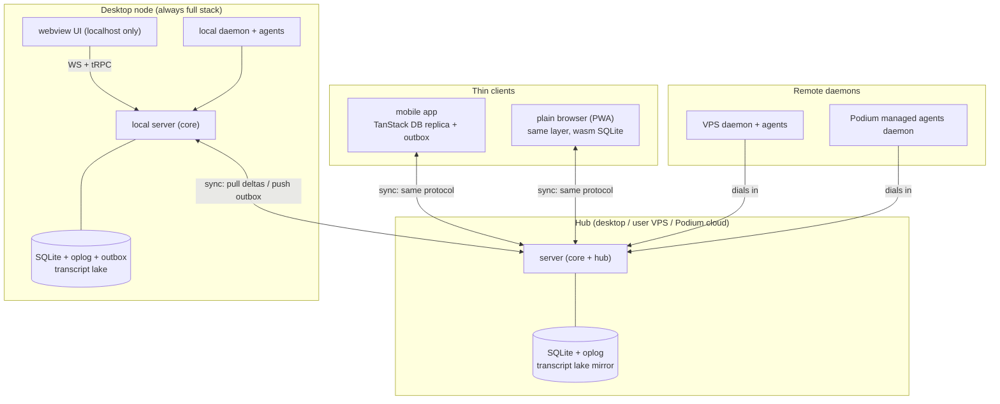
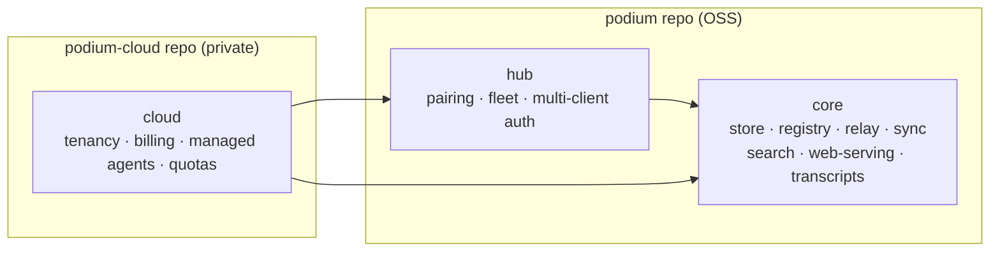
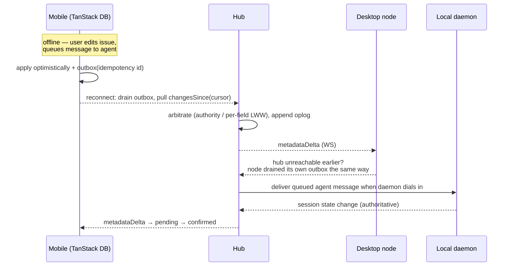
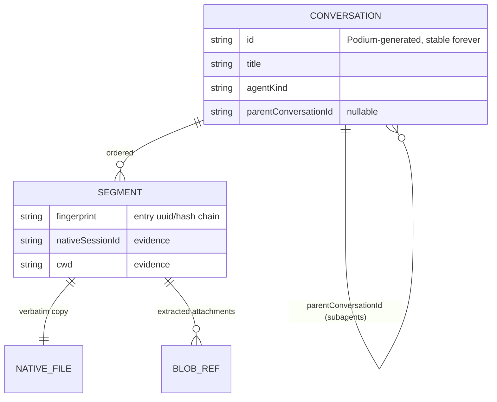

# Podium Offline & Sync Architecture

Status: **v1** · 2026-07-02
This document describes Podium's target architecture for offline-capable clients, real-time reactive metadata, transcript persistence/backup, conversation identity, unified search, and the node/hub/cloud role model. Concrete, per-phase implementation specs live in `docs/spec/`.

---

## 1. Goals

1. **Real-time reactivity** — metadata changes (sessions, issues, repos, drafts, pins…) appear on every open client immediately, in every deployment mode.
2. **Offline-capable clients** — most important on **mobile** (bad connections): read full chat transcripts/scrollback offline; author messages, queue work, and edit issues offline.
3. **Offline local agents** — with a remote/Podium-hosted hub, the desktop keeps working against its **local** agents (and issues, search, transcripts) when the hub is unreachable. Agents on other machines are read-only-stale until the link returns.
4. **Queued work as UX** — sending a message to an unreachable agent/daemon is a first-class "pending" state, not an error.
5. **Transcript backup** — server-side session backup/export as a user-facing feature (agents delete their own history; Podium doesn't).
6. **Stable conversation identity** — transcript loading must be robust no matter what agents do to their files (fork, resume, rewrite).
7. **Unified search** — one search box over agents, transcripts, settings, issues, comments; good enough to replace the current search and the resume-old-session UI.
8. **Future-proof clients** — desktop may move from Tauri/webview to native or React Native; mobile likewise. The architecture must survive client rewrites.
9. **OSS core, closed cloud** — `core` and `hub` are open source; the `cloud` module (SaaS) lives in a private repo and composes in at build time.

## 2. Rejected alternatives (and the reversal conditions)

| Option | Verdict | Reason |
|---|---|---|
| Turso DB sync (node⇄hub) | No, watch list | Requires engine swap off `bun:sqlite` on node **and** hub; no app-facing change-notification API, so the hub would diff tables to feed its own oplog (rebuilding the oplog anyway); row-level "last push wins" is device-blind and can't express daemon-authoritative rows. **Revisit if**: all clients become full nodes (no thin mobile replica) and Turso's self-hosted sync server + engine reach production maturity. |
| Replicache | No | Web-JS-only client with a proprietary data model — dies on RN/native move; maintenance mode. |
| Zero / ElectricSQL / PowerSync | No | Postgres-centric + extra sync service; breaks single-binary SQLite self-host. |
| Dexie (client store) | No | IndexedDB-only — dies on React Native. |
| CRDTs (Yjs/Automerge) as backbone | No | Metadata is server/daemon-authoritative observations; merging "session 12 is busy" is meaningless. (Yjs remains an option later for collaborative issue-description editing only.) |
| LanceDB (search) | No | Second storage engine with native bindings (fights `bun compile` packaging); built for a scale we won't reach. |
| TanStack Query + persistQueryClient | No | Response cache, not a sync engine; no cross-client reactivity, weak mutation queue. |

**The durable asset is the sync protocol, not any library.** Client libraries are replaceable consumers of it.

## 3. Topology: hub and nodes

Every deployment is the same shape: **daemons dial into a server; clients dial into a server; nodes dial into a hub.** The hub is just "whichever node is the rendezvous point."

Key invariants:

- **The desktop app always ships and runs the full local stack** (server + daemon); the desktop UI always points at `localhost`, in every mode. This is what makes local agents + issues work when the hub is unreachable — offline needs a *server* (PTY broker, registry), not just a client database.
- **Mobile/browser are thin clients**: no daemon, in-app replica (TanStack DB) speaking the same sync protocol.
- **One wire protocol, two consumer shapes**: node⇄hub and thin-client⇄server are the same oplog/outbox exchange.

### Deployment modes (all supported by the same design)

| Mode | Hub | Notes |
|---|---|---|
| All-in-one desktop | the desktop itself | No upstream configured; sync is a no-op. |
| Desktop + paired mobile | desktop (exposed) | Mobile syncs its replica from the desktop-hosted hub; desktop asleep → mobile reads replica, queues writes. |
| Desktop hub, remote daemons | desktop | VPS / Podium managed-agent daemons dial into the desktop server. |
| User VPS hub | VPS | Desktop is a node syncing upstream; UI still served locally by Tauri (updated via Tauri updater) — hub may *also* serve web UI. |
| Podium cloud hub (SaaS) | Podium cloud | Local agents keep working via the local node; desktop daemon dials out to the hub like any other daemon. Work transfer to managed cloud agents = the conversation's agent moves to a cloud daemon. |
| Web-only clients | any hub | Every server can serve the web UI (e.g. Windows until native support); browsers run the thin-client layer. |

**Migration (all-in-one → cloud)** is a one-shot transfer, not a sync feature: copy the tenant SQLite + transcript lake and flip config — or equivalently, bootstrap-by-full-resync of a fresh hub over the sync protocol.

## 4. Roles & module layout

One server codebase, composed as modules, activated by role. **This is an ease-in, not a big-bang**: today's server is simply "hub"; "node" is the same binary with the upstream sync client enabled and inbound pairing disabled. The split materializes feature-by-feature.

Rules (enforced from day one — the only early cost):

1. `core` never imports from `hub` or `cloud`; `hub` never imports from `cloud`. (Lint-enforced.)
2. `cloud` composes in at build time via a small plugin seam (route/module registration hooks) — the OSS build never references it.
3. The store stays **single-tenant-shaped**: cloud = one SQLite + one transcript lake **per tenant** (user/team). The cloud runs "many nodes' worth of core" rather than a multi-tenant store rewrite. This also keeps sync filtering trivial and makes export/deletion honest.

## 5. Sync protocol (overview)

Bespoke, defined in `@podium/protocol` (zod), building on plumbing that already exists: the single write funnel in the server store, the WS broadcast fan-out, and the proven `seq`/`sinceSeq` cursor-replay pattern from the PTY stream.

- **Oplog (read path)** — every metadata write appends a change row with a server-assigned sequence number. Clients hold a cursor; catch-up is a `changesSince(cursor)` pull, live updates are `metadataDelta` WS pushes. Compaction past a cursor → full resync. Spec: `docs/spec/oplog-read-path.md`.
- **Outbox (write path)** — client/node-local ordered mutation queue with **client-generated idempotency IDs** (adopted protocol-wide from day one; retrofitting is painful). Applied optimistically, drained upstream on (re)connect. Reused three times: mobile→server, node→hub, and queued messages to offline daemons (the server holds the queue and delivers when the daemon dials back in).
- **Conflicts (hub-arbitrated)** — *writer authority* for daemon-observed rows (session state has exactly one legitimate writer; a stale node can never clobber it); per-field last-writer-wins on event time for user-authored rows (issues, drafts, pins, snoozes, tab orders). Low contention by construction; no CRDTs.

### Entity sync classes

| Class | Entities | Behavior |
|---|---|---|
| Durable + synced | repos/worktrees, session metadata, issues (+labels/deps/comments), conversation registry, pins, snoozes, drafts, tab orders | In oplog; replicated; offline read/write per authority rules |
| Live-only | host metrics, machine liveness, attention events | Broadcast as today, memory-only, blank offline |
| Command RPCs | spawn/kill/attach, resize, file ops | Plain tRPC, require a live path to the daemon; UI disables offline (except message-send, which queues) |
| Bulk | transcripts, blobs | Separate channel + lazy policy (§6) |

## 6. Transcript subsystem

### 6.1 Storage: file lake + SQLite map (raw logs do **not** go in SQLite)

- **Segments**: verbatim append-only copies of native agent transcript files — byte-exact fidelity survives every harness's evolving JSONL dialect and makes backup/restore truthful. Cheap append-only tail sync.
- **Blobs**: images/screenshots and other rich attachments extracted into a content-addressed store (sha256-named files); referenced from the index; synced lazily/on-view.
- **SQLite** holds the map: conversation registry, segment→file mapping, cursors, search indexes.
- **Hub mirror**: nodes/daemons stream segment tails to the hub → server-side backup, retention policy, and user-facing export (tar of lake + registry slice).

### 6.2 Conversation registry (the keystone)

Agent-native artifacts (file paths, agent session IDs) are **evidence, never identity**.

- The daemon-side **resolver** links native files to conversations via fingerprints (leading-entry UUID/hash chains), fork lineage, cwd, native IDs. Resume-into-a-new-file = new segment, same conversation.
- **Bias against mis-merging**: ambiguity creates a new conversation plus a recorded low-confidence link, never silent gluing.
- Subagent transcripts = child conversations (`parentConversationId` + spawn reference) → hierarchy in UI and search.
- The resume-session UI lists registry conversations (stable ID, title, hierarchy, last-active) instead of raw artifacts — this alone fixes most of its problems.

### 6.3 Mobile offline policy

Registry always synced; segment **tails of recent/open/pinned conversations** synced into client SQLite; older segments and blobs fetched on demand. Offline reading of scrollback + full chat view works within the synced set.

## 7. Search

**v1: keyword-only, one omni-index.**

- SQLite **FTS5** (bundled in Bun's SQLite; also available in wasm-SQLite and RN SQLite builds for offline client search over the synced subset).
- Indexed: transcript text (via registry ingest), issues, comments, titles, settings keys, sessions/machines.
- Ranking: BM25 + recency + entity-type boosts. Incremental indexing hangs off the same oplog/ingest events — never a batch job.
- UI: one ⌘K command palette returning typed results (conversation, message-hit, issue, comment, session, setting, machine).

**v2 (deferred): semantic.** The search service exposes a `sources` seam; a semantic source (local embeddings; brute-force cosine or `sqlite-vec` — *not* a new storage engine) fuses in via reciprocal rank fusion later without touching the UI. The current search is bad due to missing identity/indexing, not missing embeddings.

## 8. Client data layer

| Client | Layer | Rationale |
|---|---|---|
| Desktop (Tauri webview) | **Thin/live** — current WS+tRPC against the localhost node; no client DB | The local node *is* the durable replica; localhost is always reachable |
| Mobile app / plain browser | **TanStack DB** (SQLite-backed persistence: browser wasm/OPFS, RN/Expo) + offline transactions speaking the oplog protocol | Survives a Tauri→RN move intact; live queries with joins; optimistic-transaction machinery included |
| Future fully-native client | Thin client reimplemented over native SQLite | Deliberately cheap because all smarts (arbitration, rebase) are server-side; the protocol, not the JS library, carries the architecture |

## 9. Phasing

Each phase ships independently and delivers value on its own. Each phase gets its own implementation spec in `docs/spec/` when picked up.

| # | Phase | Delivers |
|---|---|---|
| P1 | **Conversation registry** + resolver | Stable transcript loading; fixed resume UI; foundation for search/backup/sync |
| P2 | **Oplog read path** (`changes` table, `changesSince`, `metadataDelta`) | Deltas replace full-snapshot broadcasts; cross-client reactivity formalized. Spec: `docs/spec/oplog-read-path.md` |
| P3 | **Outbox write path** + idempotency IDs + pending UI | Queued work UX; offline authoring semantics (used by all later consumers) |
| P4 | **Transcript lake + hub mirror** | Backup/export feature; blob store; transcripts survive agent deletion |
| P5 | **Search v1** (FTS5 omni-index, ⌘K) | Replaces current search |
| P6 | **Thin-client replica** (TanStack DB on mobile/browser) | Mobile offline read + author |
| P7 | **Node/hub roles + node⇄hub sync** | Offline local agents with remote hub; module boundaries (`core`/`hub`) enforced from P1 onward |
| — | Later | `cloud` module (private repo), semantic search source, native clients |
