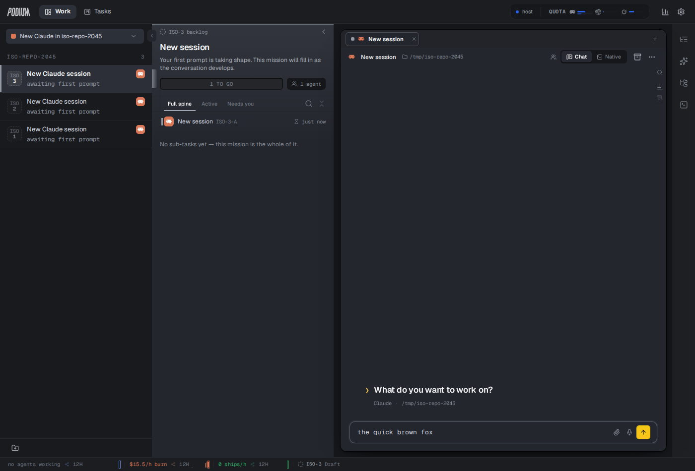
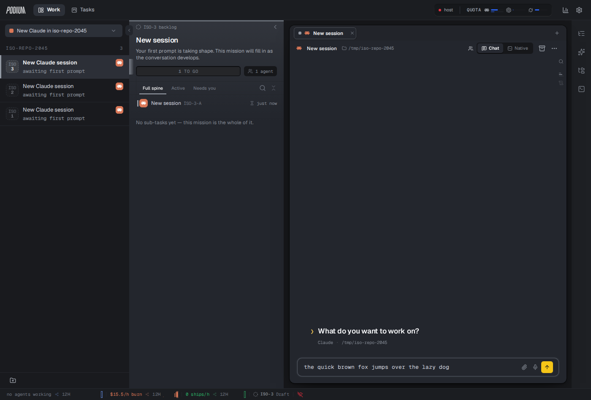
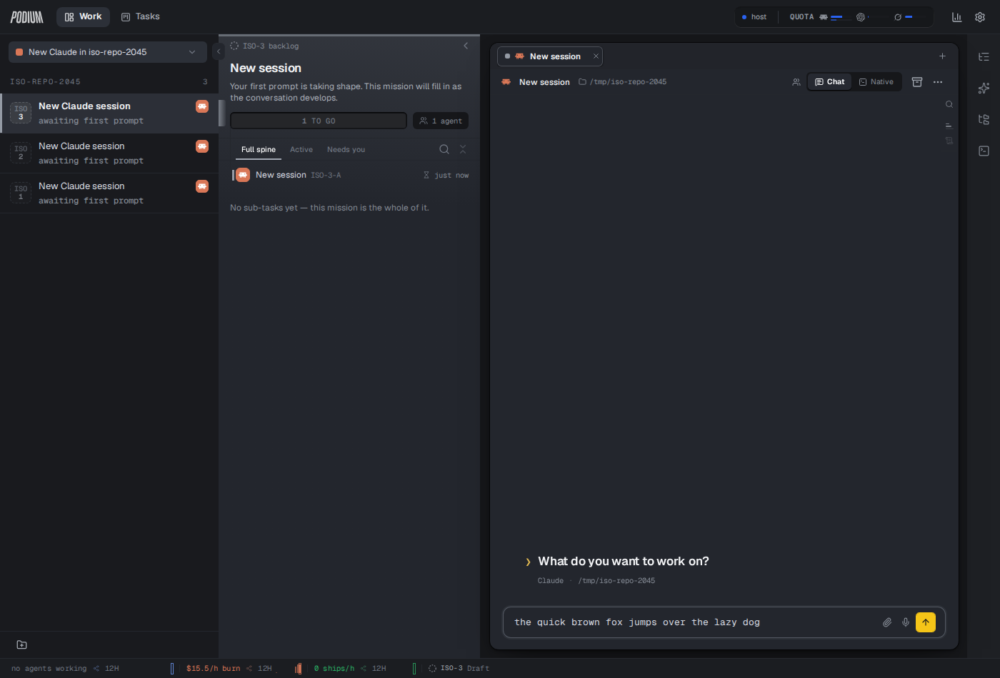

# Offline-first ChatView drafts — live browser verification

**When:** 2026-08-14 · **Code:** `757ebcd82` (POD-2045, merged to local main)
**Stack:** an isolated Podium — web `:55600` → backend `:18788`, its own state dir
(`/tmp/podium-iso-2045`) and DB. The always-on instance on `:18787` was untouched
and healthy throughout.
**Driver:** real Chromium via Playwright, reading the actual websocket frames.

The unit suites prove the rules. This proves the SYMPTOM is gone, against a real
server that really dies.

---

## The scenario

The report was *"typing is sometimes slow and sometimes loses parts of the text,
especially when the server is slow."* So the probe reproduces exactly that: type
into a real ChatView, **kill the backend process mid-sentence**, keep typing,
then let the server come back and replay its own (now stale) copy.

| | |
|---|---|
|  | **1. Connected.** 19 keystrokes produce ONE `draftEdit` frame — the wire is debounced. The server sequences it and echoes `rev 1` back to the sender. |
|  | **2. Server killed.** The host dot is red. The rest of the sentence is typed with nothing to sync to, and every character is on screen. |
|  | **3. Recovered.** The client re-offers its text on the reconnect edge and the server converges on it. |

## What came off the wire in step 3

```
→ draftEdit baseRev=1 "the quick brown fox jumps over the lazy dog"   ← reconnect flush
← sessionDraftChanged rev=1 "the quick brown fox"                     ← THE STALE REPLAY
← sessionDraftChanged rev=2 "the quick brown fox jumps over the lazy dog"
```

The middle frame is the bug. The server really does replay a document older than
what is on screen, every time a connection returns. Before this change that frame
was adopted unconditionally.

## The probe is armed

An end-state assertion cannot see this: the stale replay lands mid-burst and a
later correct frame overwrites it, so the final value is right either way — while
the person watching sees their sentence flicker back. So the composer is
**sampled every 40ms** across the whole recovery and every distinct value is
recorded. Same scenario, same stack, the only difference being the client's
adopt rule:

| build | distinct composer values across recovery |
|---|---|
| **fixed** | `["the quick brown fox jumps over the lazy dog"]` |
| **pre-fix** (adopt unconditionally) | `["…lazy dog", "the quick brown fox", "…lazy dog"]` |

The pre-fix run rolls the sentence back and then forward again. That is the
reported symptom, on screen, and it is what the fix removes.

## Not covered here

A **cold boot with the server down** shows a blank app — the shell needs the
backend to render at all (in production the backend also serves the web bundle),
so the device-local draft cache cannot be observed on that path. It still does
its job for an already-open tab, which is the case the bug was reported from.
Making the app boot offline is a separate piece of work.
